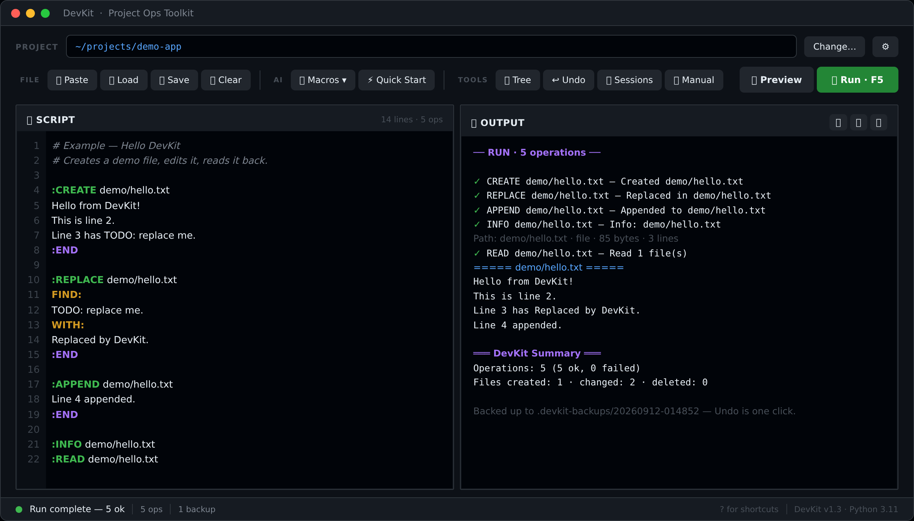
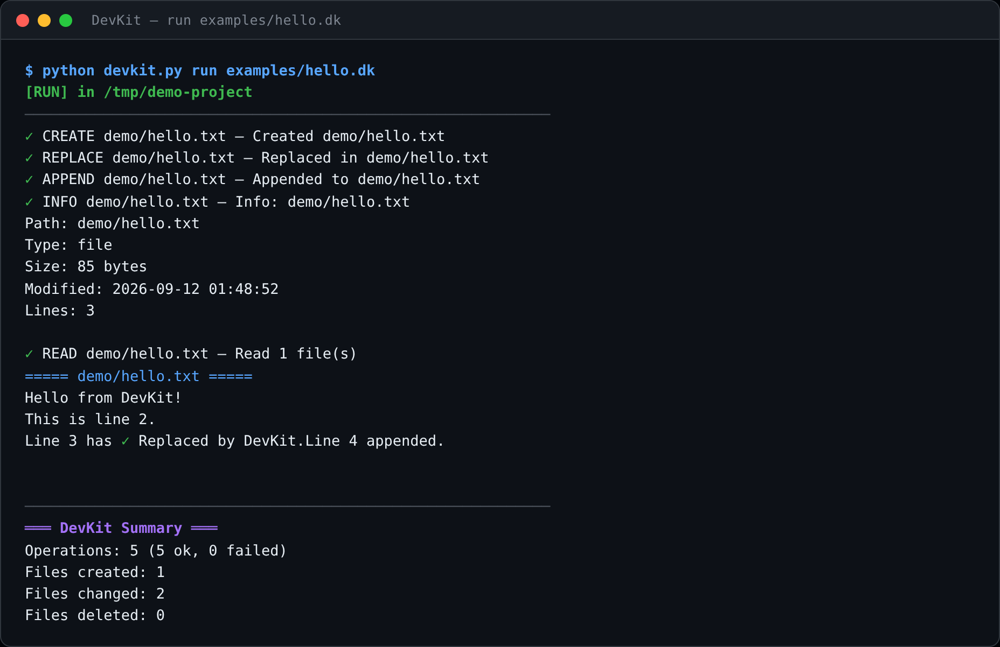
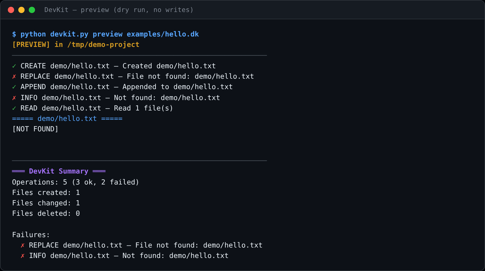
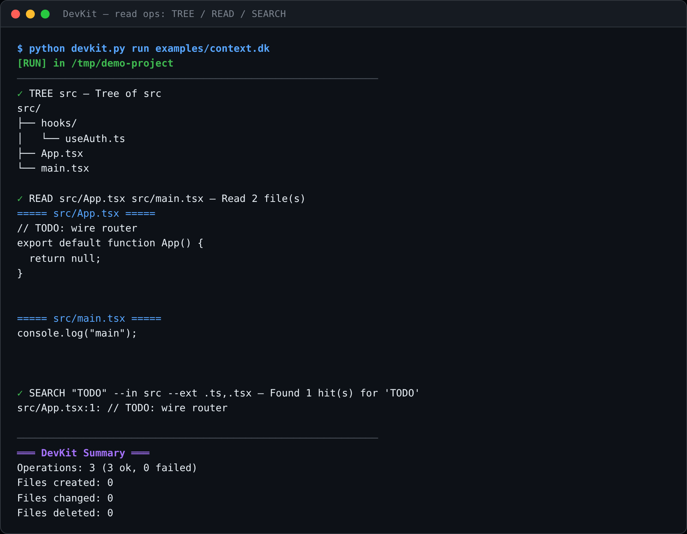
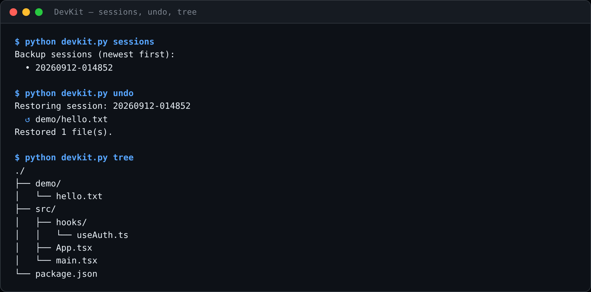

<div align="center">


# DevKit

**Portable Project Ops Toolkit — scripted, safe, auto-backed-up project edits.**

*Drop it into any project root — React, Node, Python, anything — and drive file
operations from a plain-text script. Preview every change as a diff, apply with
one click, undo with one click.*


</div>

---

## Table of Contents

1. [What is DevKit?](#what-is-devkit)
2. [Who is it for?](#who-is-it-for)
3. [Screenshots](#screenshots)
4. [Architecture — how it works](#architecture--how-it-works)
5. [Requirements](#requirements)
6. [Installation & Setup](#installation--setup)
7. [Launching](#launching)
8. [The GUI (frontend)](#the-gui-frontend)
9. [The engine (backend)](#the-engine-backend)
10. [Working with an AI assistant](#working-with-an-ai-assistant)
11. [Script syntax reference](#script-syntax-reference)
12. [Backups & undo](#backups--undo)
13. [Examples](#examples)
14. [Building a portable .exe](#building-a-portable-exe)
15. [Repository layout](#repository-layout)
16. [Troubleshooting](#troubleshooting)
17. [License](#license)

---

## What is DevKit?

DevKit is a **single-folder desktop utility** (no install, no dependencies
beyond the Python standard library) that executes *ops scripts* — small,
human-readable text files describing file operations — against any project
directory:

```text
:CREATE src/hooks/useSubscription.ts
export function useSubscription() { ... }
:END

:REPLACE src/App.tsx
FIND:
// TODO: wire router
WITH:
import { Router } from './router';
:END

RUN npm install react-query
GITCOMMIT "feat: subscription system"
```

Every run is:

- **Previewable** — a dry-run mode shows every file that would be created,
  changed or deleted, with a unified diff for each content change. Nothing is
  written until you actually run.
- **Auto-backed-up** — before any file is touched, the original is copied into
  a timestamped session folder under `.devkit-backups/`. Undo is one click
  (GUI) or one command (CLI).
- **Deterministic** — the script *is* the change. It can be saved, reviewed,
  re-run, shared, or pasted straight from an AI chat.

DevKit was built primarily to make **AI-assisted coding sessions faster and
safer**: instead of copy-pasting dozens of code blocks by hand, your AI
assistant replies with one compact DevKit script. You paste it in, preview the
diff, and apply it in a single keystroke — with a guaranteed undo path.

It is equally useful without an AI: batch renames, scripted refactors,
project scaffolding, and quick read-only project exploration (`:TREE`,
`:READ`, `:SEARCH`) all work the same way.

## Who is it for?

| Audience | Why they'd use it |
|---|---|
| **Developers pairing with AI assistants** (Claude, ChatGPT, etc.) | The AI writes one DevKit script instead of many code blocks; you apply it atomically with preview + undo. |
| **Solo devs doing repetitive edits** | Batch delete/rename/replace across a tree with glob support, without writing throwaway shell scripts. |
| **People on locked-down machines** | Pure Python stdlib — no pip installs, no admin rights. Can be built into a single portable `.exe`. |
| **Anyone who wants a safety net** | Every mutating run creates a restorable backup session automatically. |

It is a **local desktop tool**, not a web app, service, or library. There is no
network component and nothing to deploy.

## Screenshots

> The CLI screenshots below show **real captured output** from running the
> bundled example scripts against a demo project (rendered in a terminal frame
> via headless Chromium/Playwright, since this environment has no display for
> the native Tkinter window). The GUI shot is a pixel-faithful HTML
> reconstruction of the Tkinter interface using its actual theme tokens,
> layout, and real run output.

### GUI — script editor + live output



### CLI — running a script



### CLI — preview (dry run, nothing written)



### CLI — read-only context ops (`:TREE` / `:READ` / `:SEARCH`)



### CLI — backups, undo, and project tree



## Architecture — how it works

DevKit is a classic **frontend / engine split**, all in one process, all local:

```text
                       ┌────────────────────────────────────────┐
                       │                devkit.py               │
                       │      entry point & mode dispatch       │
                       └───────────────┬────────────────────────┘
              no args → GUI            │            args → CLI
        ┌──────────────────────┐       │       ┌──────────────────────┐
        │   gui.py (Tkinter)   │       │       │       cli.py         │
        │  • script editor w/  │       │       │  run / preview /     │
        │    syntax highlight  │       │       │  undo / sessions /   │
        │  • themes, palette,  │       │       │  tree / interactive  │
        │    toasts, settings  │       │       └──────────┬───────────┘
        └──────────┬───────────┘       │                  │
                   └─────────────┬─────┴──────────────────┘
                                 ▼
                   ┌──────────────────────────┐
                   │        runner.py         │   orchestration:
                   │  parse → execute → report│   per-op results + summary
                   └────┬─────────────┬───────┘
                        ▼             ▼
              ┌──────────────┐  ┌──────────────┐
              │  parser.py   │  │   ops.py     │   executors for every op
              │ script text  │  │ CREATE/WRITE │   (dry-run aware, diff
              │ → Operation  │  │ REPLACE/TREE │    generation, globbing)
              │   objects    │  │ RUN/GIT/...  │
              └──────────────┘  └──────┬───────┘
                                       ▼
                                ┌──────────────┐
                                │  backup.py   │   auto session backups,
                                │ .devkit-     │   restore, prune (keep 20)
                                │  backups/    │
                                └──────────────┘
```

**Is it frontend or backend?** Neither in the web sense — it's a **desktop
application**. In desktop terms:

- The **"frontend"** is a Tkinter GUI (`devkit_core/gui.py`, ~1,400 lines):
  a two-pane window (script editor with live syntax highlighting + output
  console) with a toolbar, command palette, themes, toasts, and a settings
  dialog. There is also a plain CLI frontend (`devkit_core/cli.py`) and an
  interactive REPL mode.
- The **"backend"** is a pure-Python engine (`parser.py` → `runner.py` →
  `ops.py` → `backup.py`) that turns script text into `Operation` objects,
  executes them against the working directory, generates unified diffs, and
  manages backup sessions. The engine is UI-agnostic — both frontends call the
  same `run_script()` function.

Key engine behaviors:

- **Dry-run flows through everything.** Every executor checks
  `ctx.dry_run`; preview mode exercises the full code path except actual
  writes.
- **Lazy backup sessions.** A backup session folder is only created the first
  time a run actually touches a file, so read-only runs never litter the
  project.
- **Paths are relative to the project root** (the working directory in CLI
  mode, or the selected folder in the GUI). Absolute paths are also accepted.
- **Exit codes** (CLI): `0` success, `1` parse error / bad usage, `2` one or
  more operations failed.

## Requirements

- **Python 3.8+** — standard library only. Tkinter (bundled with the official
  python.org installers on Windows/macOS; on Linux it may be a separate
  package, e.g. `sudo apt install python3-tk`) is needed for the GUI. The CLI
  works without Tkinter.
- *Optional:* `pip install pyinstaller` — only if you want to build the
  portable single-file `.exe`.

## Installation & Setup

There is nothing to install — DevKit is a folder. Three ways to place it:

| Style | How |
|---|---|
| **Global** | Put the folder anywhere (e.g. `C:\Tools\devkit\`) and run `python C:\Tools\devkit\devkit.py` from inside any project. |
| **Per-project** | Copy the `devkit/` folder into your project root. |
| **Portable exe** (Windows) | Run `build_exe.bat` once → copy `dist\DevKit.exe` into any project and double-click. |

```bash
git clone https://github.com/im-oree/DevKit.git
cd your-project
python ../DevKit/devkit.py        # GUI opens with your-project as the root
```

> Add these to your project's `.gitignore`:
>
> ```gitignore
> .devkit-backups/
> devkit/
> ```

## Launching

| Command | Result |
|---|---|
| `python devkit.py` | GUI |
| `devkit.bat` | GUI (Windows double-click) |
| `DevKit.exe` | GUI (portable build) |
| `python devkit.py --cli` | Interactive CLI (paste ops, `:run` to execute) |
| `python devkit.py run script.dk` | Execute a script file |
| `python devkit.py run -` | Execute a script from stdin |
| `python devkit.py preview script.dk` | Dry run — diffs only, no writes |
| `python devkit.py tree [path]` | Print project tree |
| `python devkit.py undo [session]` | Restore last (or named) backup session |
| `python devkit.py sessions` | List backup sessions |
| `python devkit.py --help` | Full built-in manual |

## The GUI (frontend)

Launching with no arguments opens a 1280×820 two-pane window:

- **Left — SCRIPT**: an editor with line numbers, undo, and live syntax
  highlighting of DevKit ops (block ops green, inline ops blue, `FIND:/WITH:`
  markers yellow, `:END` purple, strings orange, flags cyan). The header shows
  a live `N lines · N ops` count.
- **Right — OUTPUT**: a color-coded console for run/preview results, diffs,
  and read-op dumps, with copy/save/clear buttons.
- **Toolbar**: file actions (Paste / Load / Save / Clear), the **Macros**
  dropdown and Quick Start (AI collaboration helpers), tools (Tree, Undo,
  Sessions, Manual, Command palette, Shortcuts), and the **Preview** /
  **Run** buttons.
- **Status bar**: state dot, op count, clickable backup count, version info.

**Themes & settings** — three built-in themes (*GitHub Dark* — default,
*GitHub Light*, *High Contrast*), configurable fonts/sizes, line-number and
toast toggles. Settings persist to `~/.devkit_config.json`.

**Keyboard shortcuts**

| Keys | Action |
|---|---|
| `F5` | Run |
| `Ctrl+Enter` | Preview |
| `Ctrl+Shift+P` | Command palette |
| `Ctrl+/` | Toggle comment |
| `Ctrl+K` / `Ctrl+E` | Focus script / output |
| `Ctrl+,` | Settings |
| `?` | Shortcut overlay |

**Macros dropdown** — one-click clipboard payloads for AI chats:

| Button | Copies |
|---|---|
| Copy Project Tree (3 / 5) | Folder tree at depth 3 or 5 |
| Copy AI Collab Prompt | Instructions + tree + syntax |
| Copy AI Syntax Reference | Syntax cheat sheet only |
| Copy ALL-IN-ONE | Everything merged — paste into a new chat and go |

## The engine (backend)

The engine lives in `devkit_core/` and is callable without any UI:

```python
from devkit_core.runner import run_script, summarize

results = run_script(script_text, cwd="/path/to/project", dry_run=True)
print(summarize(results))
```

- `parser.parse_script(text)` → `list[Operation]` — raises `ParseError` with
  line numbers on malformed input. Handles UTF-8 BOMs, comments, inline ops,
  `:BLOCK ... :END` bodies, and single-line read ops.
- `ops.execute(op, ctx)` → `OpResult` — one executor per op kind. Mutating
  executors back the file up first (via `ctx.ensure_session()`), respect
  `dry_run`, and attach a unified diff to the result.
- `backup.py` — session create / list / restore / prune (keeps the 20 most
  recent sessions).
- `runner.summarize(results)` — the `═══ DevKit Summary ═══` block with
  ok/failed counts and created/changed/deleted file totals.

## Working with an AI assistant

The intended loop:

1. **Prime the chat** — click *Macros → Copy ALL-IN-ONE* and paste it into a
   new AI conversation. The AI now knows your project tree *and* the full
   DevKit syntax.
2. **Ask for work.** The AI first replies with a *context script*:
   ```text
   :READ src/App.tsx
   :SEARCH "TODO" --in src --ext .ts,.tsx
   :TREE src/pages --depth 2
   ```
3. **Preview → Run → Copy all output** — paste the output back to the AI so it
   sees the real file contents.
4. The AI sends the **edit script**. Preview it (check the diffs), then Run.
5. Anything wrong? **Undo last** — every touched file is restored.

## Script syntax reference

Scripts are plain text (conventionally `.dk`). `#` starts a comment; blank
lines outside blocks are ignored.

### Inline ops (one line)

```text
DELETE  src/**/*.bak                  # glob supported: * ** ? [abc]
RENAME  src/old.ts -> src/new.ts      # MOVE is an alias
MKDIR   src/newfolder
RUN     npm install lodash            # any shell command, output captured
INSTALL react-query                   # auto-detects npm / pip via lockfiles
GITADD  .
GITCOMMIT "feat: subscription system"
```

### Block ops (multi-line, terminated by `:END`)

```text
:CREATE path/to/file      # new file — fails if it already exists
<content>
:END

:WRITE path/to/file       # create or overwrite
<content>
:END

:APPEND path/to/file      # add to end
<content>
:END

:PREPEND path/to/file     # insert at start
<content>
:END

:REPLACE path/to/file     # literal find & replace
FIND:
old exact text
WITH:
new text
:END

:REGEX_REPLACE path/to/file
FIND: pattern\s+here
WITH: replacement
:END

:REPLACE_BLOCK path/to/file   # replace everything between two marker lines
FROM: // START
TO:   // END
WITH:
replacement (markers are replaced too)
:END

:INSERT_AFTER path/to/file    # also :INSERT_BEFORE
FIND:
anchor line
WITH:
inserted content
:END

:MULTI_REPLACE path/to/file   # several find/replace pairs, separated by ---
FIND:
old A
WITH:
new A
---
FIND:
old B
WITH:
new B
:END
```

### Read ops (single line, output only — no `:END` needed)

```text
:TREE src --depth 3 --exclude node_modules,dist
:READ src/App.tsx src/main.tsx
:SEARCH "TODO" --in src --ext .ts,.tsx
:LIST src/**/*.module.css
:INFO src/App.tsx
```

## Backups & undo

Every mutating run copies the *original* version of each touched file to:

```text
<project>/.devkit-backups/<YYYYMMDD-HHMMSS>/<relative path>
```

| Action | Command |
|---|---|
| Restore the latest session | `python devkit.py undo` |
| Restore a specific session | `python devkit.py undo 20260912-014852` |
| List sessions | `python devkit.py sessions` |

Sessions are auto-pruned to the most recent **20**. In the GUI, the backup
count in the status bar is clickable and *Undo* is on the toolbar.

> **Always preview first.** `Ctrl+Enter` (GUI) or
> `python devkit.py preview script.dk` (CLI) shows every pending
> create/change/delete plus a diff for each content change — only Run (`F5`)
> actually writes. Note that preview evaluates ops against the *current* disk
> state, so a later op that depends on a file created by an earlier op in the
> same script may show as "file not found" in preview while succeeding in a
> real run.

## Examples

Three ready-to-run scripts live in [`examples/`](examples):

| Script | Demonstrates |
|---|---|
| [`hello.dk`](examples/hello.dk) | `:CREATE` → `:REPLACE` → `:APPEND` → `:INFO` → `:READ` round-trip |
| [`context.dk`](examples/context.dk) | Read-only context gathering for an AI (`:TREE`, `:READ`, `:SEARCH`) |
| [`add_feature.dk`](examples/add_feature.dk) | Creating a new module and wiring it into an existing file |

```bash
cd your-project
python path/to/devkit.py preview path/to/examples/hello.dk
python path/to/devkit.py run     path/to/examples/hello.dk
python path/to/devkit.py undo
```

## Building a portable .exe

Windows, one command:

```bat
pip install pyinstaller
build_exe.bat
```

This runs PyInstaller with `--onefile --noconsole`, bundling `devkit_core/`
and `examples/` (see [`DevKit.spec`](DevKit.spec)), and produces
`dist\DevKit.exe` — copy it into any project folder and double-click.

## Repository layout

```text
DevKit/
├── devkit.py             entry point — GUI by default, CLI with args
├── devkit.bat            Windows double-click launcher
├── build_exe.bat         PyInstaller build script
├── DevKit.spec           PyInstaller spec
├── devkit_core/
│   ├── parser.py         script text → Operation objects (+ ParseError)
│   ├── ops.py            one executor per op; diffs, globs, dry-run
│   ├── runner.py         parse → execute → summarize orchestration
│   ├── backup.py         session backups, restore, prune
│   ├── cli.py            CLI commands + interactive REPL
│   ├── gui.py            Tkinter GUI (themes, palette, highlighting)
│   ├── manual.py         built-in manual (--help and GUI Manual button)
│   └── macros.py         AI collaboration clipboard payloads
├── examples/             hello.dk · context.dk · add_feature.dk
└── assets/               logo + README screenshots
```

## Troubleshooting

| Symptom | Fix |
|---|---|
| `File not found` | Paths are relative to the project folder — check the PROJECT bar (GUI) or your cwd (CLI). |
| `FIND text not found` | Whitespace differs from the file. Use `:READ` first and copy the exact text. |
| GUI won't open / `No module named tkinter` | Install Tk (`sudo apt install python3-tk` on Debian/Ubuntu) or use `python devkit.py --cli`. |
| `.exe` shows an old version | Re-run `build_exe.bat`; PyInstaller caches builds in `build/`. |
| Backups filling disk | Sessions auto-prune to 20; safe to delete `.devkit-backups/` anytime. |
| Preview shows failures for files an earlier op creates | Expected — preview never writes, so later ops can't see not-yet-created files. The real run succeeds. |

## License

Do whatever you want with it.
